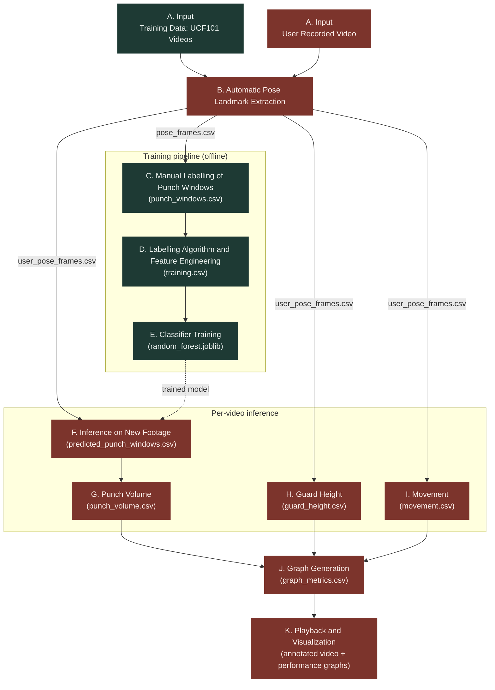
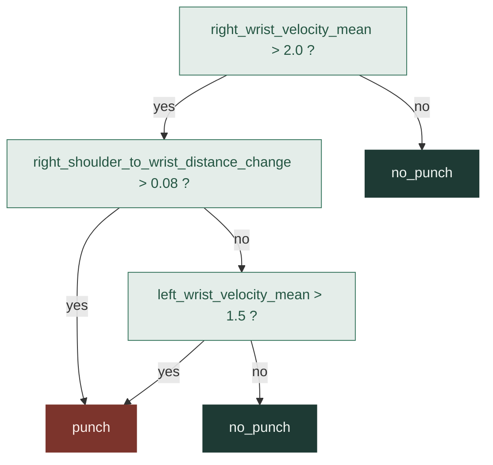
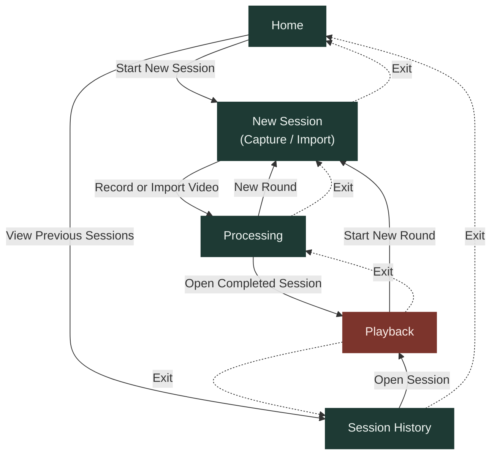

# 3. Methodology

This chapter is **the plan**: what was going to be built, and why. It
should read the same whether or not the system had actually been built yet.
What was actually built, meaning the real technology choices, algorithms,
exact calculations, and the decisions made along the way (including where
the plan changed), belongs in `04_implementation.md`. Keep that boundary
clean.

Reused where unaffected by implementation-specific changes from
`old versions/old thesis/3_old_method.md` (§3.1, §3.2, §3.4 UX flow);
everything describing the system itself is rewritten to match the plan that
was actually followed (Python-first, on-device Android port, no 3D
visualization, no Olympic Boxing Punch dataset; see `00_outline.md` for
why). Tables 3.1-3.4 and Figure 3.4 are restored and updated from the old
thesis's §3.3 equivalents. System architecture and data schema (old §3.4.1/
§3.4.2) now live in `04_implementation.md` §4.2 instead, alongside the
tools and modules that actually make them up; only the interface/UX plan
stays here. §3.5 now covers only the single-video prototype dry-run done
before Android work began; the boxer evaluation lives entirely in §3.6,
expanded from 4 to 7 dimensions to match everything Chapter 5 reports.
Neither section cites `notes/field_test_c6_d_protocol.md` any longer,
since the evaluation actually run was simpler than that written protocol
and citing it as "the plan" overstated what was followed. §3.3.1-§3.3.11
headers are now labelled
with the pipeline stage letters (A-K) from the user-drawn methodology
flowchart, recreated here as Figure 3.1; Figure 3.5 (app navigation flow)
was added under §3.4, replacing the Python/Android pipeline diagrams
removed from `04_implementation.md`.

_Status: CHANGED. Rewritten stage list: Python-first prototype then Android
port, not the old 6-stage prototyping list; now ends on the playback stage
(§3.3.11). Reformatted as a roman-numeral (i-xi) list, matching the
§1.3/§1.4 list style._
## 3.1 Introduction
This chapter describes the methodology used to design, develop, and
evaluate a boxing performance tracker: first validated end-to-end as a
Python prototype, then ported to run entirely on-device as an Android app.
The project prioritizes a practical balance. Models and processing must be
accurate enough to be useful while remaining lightweight enough to run on a
phone with no server dependency and no round-trip to a backend.

The methodology is organized as a sequence of interlinked stages:
i) dataset collection
ii) landmark extraction
iii) manual labelling
iv) feature engineering
v) model development
vi) punch prediction on new footage
vii) per-metric computation
viii) graph generation
ix) a playback stage that presents the results back to the boxer
x) system design
xi) on-device porting.

Each stage includes iteration loops for refining features, thresholds, and
model parameters based on empirical results, and the evaluation strategy
set out later in this chapter (§3.6) is what determines whether those
results are good enough to move on to the next stage.

_Status: CHANGED. MediaPipe Pose Landmarker/RF framing replaces the old
BlazePose+TFLite plan; adds the "validate in Python first" decision._
## 3.2 Research Design
This research follows a quantitative experimental design combined with
software engineering practice. The experimental component develops and
evaluates a supervised classifier (punch / no_punch) on engineered features
derived from MediaPipe pose landmarks. The engineering component implements
first a Python prototype, then an Android application that reimplements the
same pipeline on-device, with skeleton-overlay video and synchronized
graphs as output.

The first key decision concerns the pose estimator. MediaPipe Pose
Landmarker was selected for its CNN-based architecture optimized for
mobile inference, extracting 33 landmarks per frame with x/y/z coordinates
and a per-landmark visibility score.

The second decision concerns modeling strategy. An interpretable,
lightweight Random Forest classifier, trained on engineered features
rather than raw coordinates, was chosen for robustness on a limited,
heterogeneous dataset and for remaining inspectable, which matters given
how small and varied the available training footage is (§3.3.1).

The third decision concerns validation order. The full pipeline, including
prediction on new footage, is validated in Python *before* any on-device
work begins, so that any accuracy problems are caught once, in the
faster-to-iterate Python environment, before they are compounded by a
second implementation (see §3.3.6).

_Status: CHANGED (section header only; see subsections below). §3.3.1-
§3.3.11 subsection headers reworded to match Figure 3.1's flowchart node
labels exactly (e.g. "Automatic Pose Landmark Extraction" rather than
"MediaPipe Landmark Extraction"), so the diagram and the section titles
use identical wording; only the titles changed, not the body text or
numbering._
## 3.3 Proposed Methodology
This section describes the steps used in the core pipeline, expanding on
the three key decisions outlined in §3.2. The proposed methodology is
organized into six principal parts: data collection, pose-landmark
extraction, feature engineering, Random Forest model development, punch
prediction and per-metric computation on a user's video, and graph
generation followed by playback. Figure 3.1 shows the full pipeline, with
each stage labelled A-K to match the subsection headers below.

**Figure 3.1: Methodology Flowchart**

Guard height and movement (H, I) are computed directly from the same
landmark data as the punch inference step (F), not from F's output. Only
punch volume (G) depends on F's predicted punch windows. §3.3.1-§3.3.11
below document each stage in turn.

_Status: CHANGED. Dropped the Olympic Boxing Punch Dataset from the old
plan; Table 3.1 updated to match, drill description aligned to the
standardized drill described in §3.6._
### 3.3.1 Input (Stage A)
Two video sources are used: public boxing footage (the UCF101 action
recognition dataset's boxing subset) for volume and variety, and
self-recorded smartphone video to match the app's own real-world recording
conditions. Because UCF101 clips were not collected for pose-estimation
research, they vary uncontrolled in camera angle, lighting, background,
recording quality, and frame rate. This variation is treated as a
characteristic of the dataset, not a confound to eliminate. All videos are
processed through the same extraction pipeline (§3.3.2) to keep landmarks
consistent across sources. Table 3.1 lists the two sources and how each is
used.

**Table 3.1: Data Collection**

| Dataset | Description | Purpose | Labelling |
|---|---|---|---|
| UCF101 (Boxing Subset) | Public action-recognition dataset containing general boxing footage from varied, uncontrolled sources (camera angle, lighting, frame rate). | Provides the volume and variety of footage needed to train the punch classifier. | Manually labelled (§3.3.3) |
| Self-Recorded Smartphone Videos | Structured drill sessions (jab, jab-cross, lead hook, and freestyle combination work) recorded by boxers on their own phones. | Reserved exclusively for testing under realistic mobile conditions; never used for training, to avoid data leakage. | Not labelled; used as-is for evaluation (§3.6) |

_Status: CHANGED. Dropped 30fps normalization; Table 3.2 rewritten around
the actual CSV plus review-video workflow, timestamped rather than
frame-rate-normalized._
### 3.3.2 Automatic Pose Landmark Extraction (Stage B)
Each video is processed with MediaPipe Pose Landmarker, which detects 33
landmarks per frame (x, y, z, plus a per-landmark visibility/confidence
score). Output is written to a structured, per-frame CSV
(`video_id, frame_index, timestamp_ms`, coordinates per landmark,
`pose_detected`) for subsequent labelling and feature engineering.
Timestamping each frame in milliseconds, rather than assuming a fixed frame
rate, is what lets clips of different frame rates (an unavoidable
consequence of using UCF101, §3.3.1) be windowed consistently later
(§3.3.4). An annotated review video, the same skeleton drawn over the
source footage with the frame number burned in, is generated alongside it,
specifically so a human reviewer can identify punches in the next stage.
Table 3.2 outlines this workflow.

**Table 3.2: Landmark Extraction Workflow**

| Step | Description | Input | Tools | Output |
|---|---|---|---|---|
| 1. Video Import | Load a video from a dataset or a recording for processing. | Collected video file | Python | Raw video frames |
| 2. Pose Estimation | Apply MediaPipe Pose Landmarker to extract 33 landmarks per frame, each with x, y, z coordinates and a visibility score. | Video frames | MediaPipe Pose Landmarker | Per-frame landmark coordinates and visibility |
| 3. Timestamping | Record a video identifier, frame index, and millisecond timestamp alongside each frame's landmarks. | Landmark coordinates | Python | Structured per-frame CSV |
| 4. Review Rendering | Draw the detected skeleton and frame number onto the source footage. | Structured CSV, source video | Python, OpenCV | Annotated review video |

_Status: CHANGED. Same substance as before, expanded slightly for length/
flow parity with the rest of the chapter._
### 3.3.3 Manual Labelling of Punch Windows (Stage C)
A human reviewer with boxing knowledge watches the annotated review video
and records, for each punch observed, the video identifier and the punch's
start and end frame. This produces one label per punch, a punch window,
rather than a frame-level label, since a punch is inherently an interval,
not an instant, and collapsing it to a single frame would throw away
exactly the duration information §3.3.4's windowing depends on. Frame-based
labels are later converted to millisecond ranges using each frame's
timestamp, so the manual review workflow itself does not need to account for
source videos having different frame rates.
_(Checking these labels for correctness, an audited quality-control step,
is deliberately not part of this stage. See §3.6.2 for why it is planned
as an evaluation activity instead.)_

_Status: CHANGED. Old's guard/punch/footwork 3-category framing replaced
with the actual wrist/elbow motion features; Table 3.3 added._
### 3.3.4 Labelling Algorithm and Feature Engineering (Stage D)
Each labelled punch window, plus a matching set of sampled `no_punch`
windows, is converted into one feature row rather than being used as raw
coordinates. Motion-based and body-relative features are computed: wrist
and elbow velocity, and wrist/arm position relative to the shoulder and
body center. These are chosen because a punch is not simply "movement in
general" but a specific pattern of arm extension relative to the body,
which raw coordinates alone do not capture well (see §2.2.2 for why wrist,
elbow, and shoulder specifically). The result is a labelled training
dataset: one row per window, `label ∈ {punch, no_punch}`. Table 3.3
summarizes the core features computed for each window.

**Table 3.3: Summary of Core Features**

| Feature | Movement Focus | Measurement Approach |
|---|---|---|
| Wrist / Elbow Velocity | Speed of arm extension during a punch | Frame-to-frame displacement of the wrist and elbow landmarks (mean, standard deviation, and max per window) |
| Wrist Position Relative to Shoulder | How far the hand has extended from the body | Distance between the wrist and shoulder landmarks |
| Arm Position Relative to Body Center | Overall arm extension away from the torso | Distance between the wrist/elbow and the body's center point |
| Shoulder-to-Wrist Distance Change | Extension over the course of the window | Change in shoulder-to-wrist distance from the start to the end of the window |
| Wrist Forward Extension Change | Forward-reaching motion, as opposed to lateral or vertical movement | Change in the wrist's forward-axis position over the window |

_Status: CHANGED. Dropped TFLite conversion and the multi-task (guard/
punch/movement) framing; Table 3.4 and Figure 3.4 (mermaid) added._
### 3.3.5 Classifier Training (Stage E)
A Random Forest classifier is trained on the engineered features to
distinguish punch from no_punch windows. Random Forest is chosen, over a
neural network, because it performs well on small-to-moderate,
heterogeneous datasets, handles noisy pose-derived input effectively, is
resilient to overfitting, and remains interpretable, which matters for a
dataset this size and this varied in source (§3.3.1). Class balancing is
planned to account for the natural imbalance between punch and no_punch
windows in real footage. The trained model, along with the exact list and
order of feature columns used, is saved so that later prediction (§3.3.6)
and the eventual Android port (§4.4.2) use an identical feature structure.
Table 3.4 outlines this development pipeline, while Figure 3.4 shows an
illustrative example of one decision tree from the forest.

**Table 3.4: Random Forest Classifier Development Pipeline**

| Step | Task | Tools | Expected Output |
|---|---|---|---|
| 1. Data Split | Partition the engineered dataset into a held-out evaluation split, grouped by video (§3.6.3) rather than by row, so windows from the same clip cannot leak across the split. | scikit-learn | Grouped train/held-out split |
| 2. Model Training | Train a Random Forest on the engineered features, with class balancing to correct for the natural punch/no_punch imbalance. | scikit-learn (`RandomForestClassifier`) | Trained model |
| 3. Evaluation | Compute accuracy, precision, recall, F1-score, and a confusion matrix on the held-out split. | scikit-learn metrics | Evaluation report |
| 4. Export | Save the trained model alongside the exact list and order of feature columns used. | joblib | `random_forest.joblib` |

**Figure 3.4: Example Random Forest Decision Tree (illustrative)**

One of the 300 trees in the forest, shown to illustrate the kind of split
the model learns (velocity and distance-change thresholds), not the actual
exported tree structure.

_Status: CHANGED. Reframed around applying the trained model to a user's
video to produce punch predictions, which §3.3.7-§3.3.9 are built from;
the "validate in Python first" reasoning is kept but is no longer the
section's main framing._
### 3.3.6 Inference on New Footage (Stage F)
Once trained, the classifier is applied to a new video, whether a fresh
self-recorded session or any other video supplied to the app, to produce
the punch predictions the rest of the pipeline is built from. The same
MediaPipe extraction used during training (§3.3.2) is run on the new video
to produce its landmark CSV. A fixed-duration sliding window is then passed
across that data, computing the identical feature set used at training
time (§3.3.4), and each window is classified as punch or no_punch by the
trained model. Consecutive "punch" windows are merged into punch spans, so
a single punch that happens to straddle more than one window is still
reported once rather than several times. The output of this stage, a list
of punch spans with start and end times, is what punch volume (§3.3.7) is
computed from directly, and what guard height and movement (§3.3.8,
§3.3.9) are computed alongside, from the same underlying landmark data.

This prediction step is deliberately validated in Python before any
Android work begins, rather than left until porting. The same prediction
logic implemented here is what later gets ported to Android (§4.4.2), so
any accuracy or edge-case problems specific to the model or the windowing
logic are caught once, in the faster-to-iterate Python environment, rather
than being discovered only after a second implementation.

_Status: CHANGED. Same computation as before; now explicitly framed as
consuming the punch predictions from §3.3.6, and mentions combinations
(§2.2.3)._
### 3.3.7 Punch Volume (Stage G)
Punch volume, defined in §2.2.4 as the rate of punches thrown, is computed
from the punch predictions produced in §3.3.6. Punches occurring close
together in time are grouped into a combination (§2.2.3), and each point on
the uniform metric grid reports the running punch count within whichever
combination covers that point. Because punch volume is a naturally sparse,
bursty signal, a handful of punches within a short combination, then
nothing, it is planned to be left unsmoothed, unlike the other two metrics
below. Smoothing would flatten short combinations into near-nothing.

_Status: NEW. Same as §3.3.7._
### 3.3.8 Guard Height (Stage H)
Guard height, defined in §2.2.4 as how consistently the guard is held up,
is computed per window directly from the extracted landmarks, using the
vertical distance between the head (nose landmark) and whichever guarding
wrist sits higher. A larger value means the guard is held further above
the head. A value near zero or negative means the guard has dropped to
chin/chest height or below. Because a boxer may extend one hand to punch
while the other still guards, the higher of the two wrists is used for each
window, rather than averaging both.

_Status: NEW. Same as §3.3.7._
### 3.3.9 Movement (Stage I)
Movement, defined in §2.2.4 as general footwork/ring activity, is computed
per window as the average frame-to-frame speed of the hip midpoint (the
average of the left and right hip landmarks), using only horizontal-plane
displacement. Vertical displacement is deliberately excluded, since bobbing
up and down is not footwork and would otherwise be conflated with actual
repositioning.

_Status: NEW. Not separated out in the old plan._
### 3.3.10 Graph Generation (Stage J)
The three independently computed metrics (§3.3.7-§3.3.9) are merged into a
single per-window result, aligned on the same window grid so they can be
plotted together. For display, guard height and movement are planned to be
smoothed (to reduce frame-to-frame jitter) and downsampled (to keep the
number of plotted points reasonable for a full session); punch volume is
planned to stay raw and at full resolution through both steps, per §3.3.7,
since smoothing would undo the exact bursty shape it is meant to show.

_Status: NEW. Added as the final pipeline stage; ties directly into the
playback screen described in §3.4._
### 3.3.11 Playback and Visualization (Stage K)
The final stage presents the results to the boxer: the session video,
synced to the three graphed metrics on a shared timeline, alongside
standard playback controls so a boxer or coach can step through a session
and see exactly which moment on a graph corresponds to which moment in the
footage. This is the culmination of the whole pipeline. The earlier stages
exist to produce accurate, well-timed metrics, and this stage exists to
make those metrics legible against what actually happened on video, rather
than presented as numbers in isolation.

_Status: CHANGED. System architecture and data schema moved out to
`04_implementation.md` §4.2, since that content is what the actual system's
tools and modules make up; only the interface/UX plan stays in this
chapter. Expanded to mention the Figma mockups and the four screens
explicitly. Figure 3.5 (app navigation flow) added, replacing the Python/
Android pipeline diagrams removed from `04_implementation.md`._
## 3.4 Interface & UX Design
This section describes the planned interface layout: the major screens and
the interactions between them. System architecture (logical modules, the
Python/Android split) and data schema now live in `04_implementation.md`
§4.2, alongside the rest of what was actually built.

The interface is planned around four screens, first mocked up in Figma
before implementation:
- **Home / Capture**: start a new recording or import an existing video.
- **Processing**: shown while the video runs through pose extraction,
  classification, and metric computation.
- **Playback**: the session video alongside the three performance graphs
  (guard height, punch volume, movement) with standard playback controls,
  matching the playback stage described in §3.3.11.
- **Session History**: browse and compare past sessions.

This four-screen structure is reused from the old thesis's UX plan (still
accurate, aside from the 3D skeleton element it originally assumed for the
playback screen, dropped per §4.4.5).

Figure 3.5 shows how the four screens connect. Solid arrows indicate
forward navigation, and dashed arrows indicate exit or back navigation.

**Figure 3.5: App Navigation Flow**

Playback's exit returns to whichever screen opened it, Processing or
Session History, matching the two real entry points into it. A persistent
status bar, visible on any screen except Processing while a video is being
processed, also gives a shortcut directly into Processing or straight to
the finished session, not shown above to keep the primary flow readable.

_Status: CHANGED. Refocused entirely on the prototype dry-run that
happened before Android work began; the boxer evaluation moved out to
§3.6. Shortened considerably; subsections collapsed since there's no
longer enough distinct content to need them._
## 3.5 Experimental Setup
*(renumbered from old §3.6; old §3.5 "Implementation" is promoted to its
own chapter, see `04_implementation.md`)*
Before Android work began, the Python prototype is planned to be run end
to end, as a dry run, on a single self-recorded video, filmed under good
conditions (one subject, clear framing, steady lighting), so that any
problem found is a pipeline problem, not a footage problem. This is a
development-time verification step, not the formal evaluation. It exists
to confirm the plan actually works before committing to a second,
harder-to-iterate implementation on Android (§3.2), and before spending
the boxer testing time described in §3.6. Table 3.5 lists what is planned
to be checked.

**Table 3.5: Prototype Dry-Run Checks**

| Checkpoint | What Is Verified |
|---|---|
| Dataset entries | After extracting and labelling the video, the new rows added to the pose and training datasets (§3.3.1-§3.3.4) are checked for plausibility: correct video ID, sane coordinate ranges, correctly matched labels. |
| Feature engineering | The computed features (§3.3.4) are checked to visibly differ between labelled punch and no_punch windows, confirming the feature set captures the intended motion pattern rather than noise. |
| Random Forest parameters | Hyperparameter values are tried against this small dataset before settling on the values used in training (§3.3.5), checking that predictions on the same video's punches look reasonable. |
| Graph generation | The rendered punch volume, guard height, and movement graphs (§3.3.10) are checked by eye against the source video, confirming they track what actually happened on screen. |

Once these checks are satisfactory, the same pipeline is carried into the
formal evaluation described in §3.6, and Android implementation begins
(§4.4).

_Status: CHANGED (renumbered from old §3.7). Expanded from 4 to 7
dimensions to match everything Chapter 5 actually reports (added Metric
Validity, On-Device Performance, Error/Robustness Testing); overview table
added. No longer cites `notes/field_test_c6_d_protocol.md`, since the
boxer evaluation actually run was simpler than that written protocol._
## 3.6 Evaluation Strategy
*(renumbered from old §3.7)*
The evaluation strategy determines whether the system reliably extracts
pose data from mobile footage, classifies punches with sufficient
accuracy, computes metrics that reflect what actually happened in the
video, runs acceptably on a real phone, holds up under conditions beyond
the single-subject case, and presents results in a way that meaningfully
supports training analysis. Evaluation is planned to use the self-recorded
smartphone videos described in Table 3.1 (§3.3.1): boxers of varying
experience performing a standardized drill (jab, jab-cross, lead hook,
freestyle combination work) on their own phones, reserved exclusively for
testing to avoid data leakage from training. A manual live count of
punches thrown during each recording is kept alongside it, giving a
ground-truth punch count to check the app's punch volume against (§3.6.4).

Table 3.6 summarizes the seven dimensions assessed, in the order they are
evaluated: from the data the system depends on, up to the system as
experienced by an actual user.

**Table 3.6: Evaluation Dimensions**

| # | Dimension | Checks |
|---|---|---|
| 1 | Pose Quality and Visualization Validation (§3.6.1) | Landmark tracking stability and skeleton-overlay accuracy |
| 2 | Label Quality Auditing (§3.6.2) | Correctness of the manually created training labels |
| 3 | Model Accuracy Evaluation (§3.6.3) | Random Forest classification accuracy on held-out data |
| 4 | Metric Validity (§3.6.4) | Whether punch volume, guard height, and movement reflect what actually happened |
| 5 | On-Device Performance (§3.6.5) | Processing time on real phones, with no server dependency |
| 6 | Error / Robustness Testing (§3.6.6) | Behavior under multiple people in frame and unfamiliar motion |
| 7 | User-Centered Evaluation (§3.6.7) | Real boxers rating clarity of and trust in the app |

_Status: CHANGED. Dropped the `notes/field_test_c6_d_protocol.md`
citation; the multi-person scenario is described directly instead of
pointing at that document._
### 3.6.1 Pose Quality and Visualization Validation
Extracted landmarks and the resulting skeleton overlay are validated
against the two conditions most likely to break them in practice.
The first is multiple people in frame, checking specifically whether
tracking stays correctly locked onto the intended subject rather than
jumping between people. The second is general visual accuracy, comparing
the skeleton overlay and the resulting guard-height and movement readings
directly against the source video.

_Status: CHANGED (unchanged position; content unchanged from the previous
draft)._
### 3.6.2 Label Quality Auditing
*(moved in from §3.3.3; this is planned as an evaluation/QC activity, not
a construction step)* Before manual punch labels are trusted for training,
an automated audit is planned to check them: video identifiers exist and
match extracted pose data, start/end frames are valid and non-reversed,
punch durations fall within a plausible range (flagging implausibly short
or long labels), and no frame range references data outside what was
actually extracted for that video. This functions as quality control on
top of the manual labelling process (§3.3.3), not a replacement for it.

_Status: CHANGED (unchanged position; content unchanged from the previous
draft)._
### 3.6.3 Model Accuracy Evaluation
The Random Forest classifier is evaluated on a held-out partition of the
engineered feature dataset, reporting accuracy, precision, recall, and
F1-score for punch detection, with confusion matrices to identify
misclassification patterns. Critically, the held-out split is planned to be
**grouped by video**, not a per-row shuffle. A per-row shuffle would let
near-duplicate, overlapping windows from the same clip leak across both
sides of the split and produce an inflated, misleading accuracy figure
(this exact failure mode is documented for the abandoned on-device
alternative in §4.4.2, which is why it is called out explicitly here as
planned methodology rather than left implicit).

_Status: NEW. Fills a gap: Chapter 5 §5.5 reports metric validity results
with no corresponding planned-evaluation subsection until now._
### 3.6.4 Metric Validity
Classifier accuracy on labelled windows (§3.6.3) is necessary but not
sufficient. The three computed metrics need to reflect what actually
happened across a whole session, not just what the classifier predicts in
isolation. Punch volume is planned to be checked against the manual live
punch count described above, reported as recall: punches the app recorded
divided by punches actually thrown. Guard height and movement do not have
an equivalent objective count to check against, so they are instead
planned to be checked qualitatively, comparing the rendered graph directly
against the source video to confirm its rises and falls line up with
visible changes in guard position and footwork.

_Status: NEW. Fills a gap: Chapter 5 §5.4 reports on-device performance
results with no corresponding planned-evaluation subsection until now._
### 3.6.5 On-Device Performance
Because the app runs the entire pipeline on-device with no server, the
end-to-end processing time (capture through pose extraction,
classification, and graph generation) is planned to be measured on real
phones for representative clip lengths, to confirm processing stays within
a reasonable multiple of the clip's own length rather than being
impractically slow for everyday use.

_Status: NEW. Fills a gap: Chapter 5 §5.6 reports error/robustness testing
results with no corresponding planned-evaluation subsection until now._
### 3.6.6 Error / Robustness Testing
Beyond accuracy under normal conditions, the system is planned to be
checked for how it fails, not just whether it fails: whether a second
person entering or leaving frame produces a crash, a silently wrong
result, or a clean recovery once they leave; and whether motion
dissimilar to a punch, such as a kick or another sport's strike, is
incorrectly counted as one, or correctly left uncounted.

_Status: CHANGED (moved from §3.6.4 to §3.6.7; content unchanged)._
### 3.6.7 User-Centered Evaluation of Interface and Clarity
A small user evaluation is planned with boxers of varying experience level,
reviewing a recorded session on the app's playback screen (§3.3.11,
§3.4) and rating clarity of the skeleton overlay, ease of graph
interpretation, and whether the reported punch count/guard trend/movement
matched their own sense of what happened, on a Likert scale plus
open-ended questions (instrument: `notes/tester_questionnaire.md`).

_Status: CHANGED. Rewritten to summarize this chapter's own structure
(§3.2's three key decisions, §3.3's eleven-stage pipeline, §3.4's
interface plan, §3.5's dry run, §3.6's evaluation strategy) directly,
rather than mirroring the old thesis summary's paragraph shape._
## 3.7 Summary
This chapter set out the methodology for building and evaluating a mobile
boxing performance tracker, following a quantitative experimental design
paired with software engineering practice (§3.2). Three key decisions
shaped the approach: MediaPipe Pose Landmarker as the pose estimator, a
Random Forest classifier chosen over a neural network for its robustness
and interpretability on a small, heterogeneous dataset, and validating the
full pipeline in Python before any on-device work begins.

The proposed methodology (§3.3) follows eleven interlinked stages, from
collecting training and testing footage, through automatic pose landmark
extraction, manual labelling, and feature engineering, to training the
Random Forest classifier and applying it to a new video, from which three
independently computed metrics (punch volume, guard height, and movement)
are merged into a single graph-ready output presented to the boxer through
a playback stage.

§3.4 describes the planned four-screen interface, from capture through
processing to playback and session history. Before any Android work
begins, the Python prototype is planned to run end to end on a single
self-recorded video as a development-time dry run (§3.5). The finished
system is then assessed against a seven-dimension evaluation strategy
(§3.6), covering pose and label quality, classifier accuracy, metric
validity, on-device performance, robustness, and user-centered evaluation
with real boxers.

Chapter 4 documents what was actually built against this plan, and
Chapter 5 reports the resulting outputs and evaluation results.
