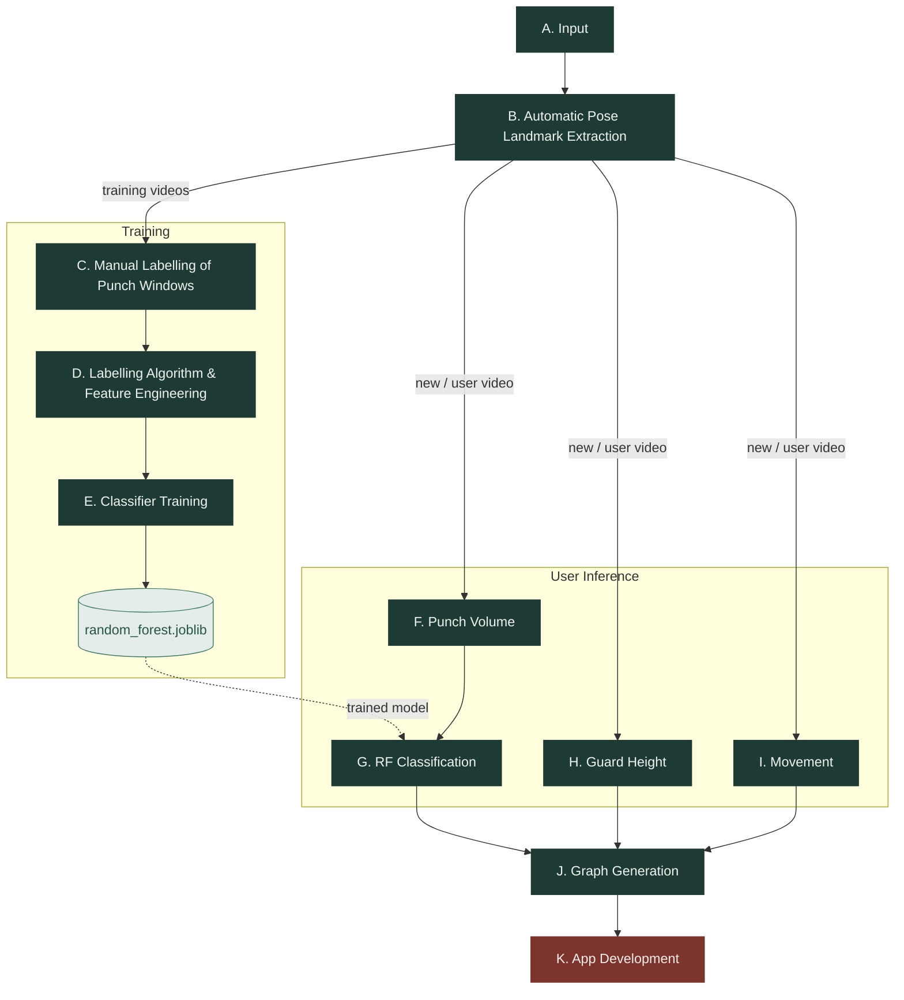
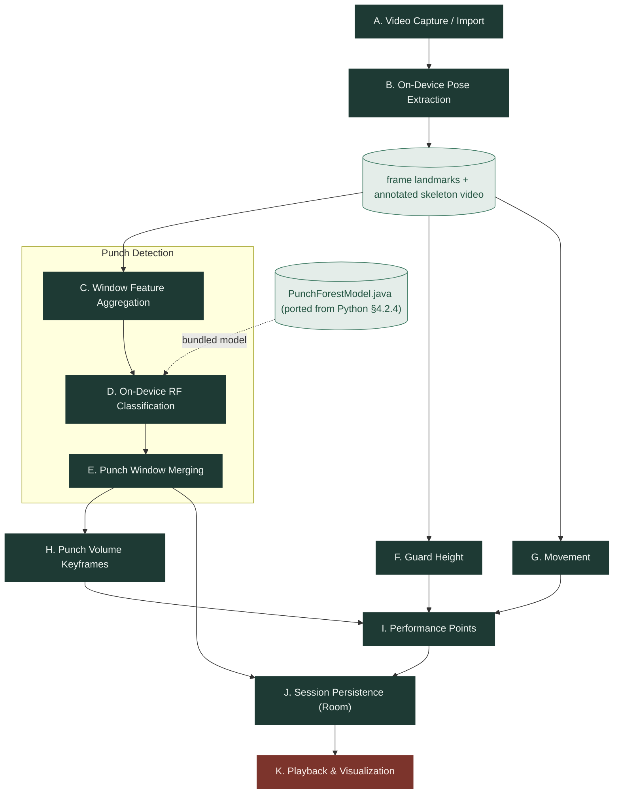

# 4. Implementation

*(Renamed from "System Development" — see `00_outline.md`.)* Documents what
was actually built: the specific technology, algorithm, calculation, and
(where relevant) database used at each stage, and why, for both the Python
prototype and the Android port. Chapter 3 is the plan; this is the record of
what actually happened, including everywhere the plan changed on contact
with implementation. The Python-side detail here draws heavily on
`old versions/old article/03_meth.md`, which documents stages B–F more
precisely than anything written before it.

## 4.1 Development Environment & Tools

| Component | Technology | Notes |
|---|---|---|
| Python pipeline | Python, pandas, NumPy, scikit-learn | Batch/offline processing and model training |
| Pose estimation (both platforms) | MediaPipe Pose Landmarker (`pose_landmarker_lite.task`) | Lite variant chosen for speed; same model family used Python-side and Android-side |
| Model export | m2cgen | Transpiles the trained scikit-learn RandomForest to a plain Java class — see §4.3.2 for why this replaced a TensorFlow Lite model |
| Android app | Kotlin, Jetpack Compose | UI and on-device pipeline |
| On-device persistence | Room (SQLite) | See §4.3.4 |
| Model serialization | joblib | `random_forest.joblib` — model + exact feature-column order, so training and inference (Python and Android) can never silently drift out of sync |

No server/database is used at inference time on the Android side beyond the
local Room database — the app has no network dependency.

## 4.2 Python Implementation

### 4.2.1 Pose Extraction Pipeline
`pose_extractor.py` processes each training video frame by frame using
MediaPipe Pose Landmarker (`models/pose_landmarker_lite.task`) to extract
33 3D body landmarks. For every frame it records a video identifier, frame
index, timestamp, a pose-detected flag, and each landmark's coordinates and
visibility, writing the result to `data/pose_frames.csv`. It can
additionally render an annotated review video with the detected skeleton
and the frame number drawn directly onto the footage — this is the video a
human reviewer watches in the next stage. `extract_user_pose_frames.py`
mirrors this logic for a single new video at inference time, producing an
equivalent but unlabelled CSV through an independent code path from the
training extraction, so that training data and live predictions never
share a path that could introduce data leakage.

### 4.2.2 Manual Labelling & Label-Auditing Tooling
A human reviewer watches the annotated review video and, for each punch
observed, records the video identifier and the punch's start/end frame,
building `punch_windows.csv` — one row per manually identified punch,
expressed in frame numbers. Frame-based labels are automatically converted
to millisecond ranges downstream using each frame's `timestamp_ms`, so the
manual review step itself is unaffected by a source video's frame rate.

`audit_punch_labels.py` then runs over `punch_windows.csv` before it's used
for training — the automated implementation of the planned quality-control
step (§3.6.2). It checks for missing video identifiers, invalid or reversed
start/end frames, implausibly short or long punch durations, and labels
that reference frames outside the range actually covered by the
corresponding pose data. This is quality control layered on top of the
manual process, not a replacement for it.

### 4.2.3 Feature Engineering
`build_training_csv.py` combines `pose_frames.csv` with
`punch_windows.csv` to build the supervised training set. Windows are
fixed-**duration**, defined in milliseconds (`--window-ms`, default 250 ms)
rather than a fixed frame count — necessary because UCF101 clips don't
share a common frame rate, so a fixed frame count wouldn't correspond to a
fixed amount of real-world time across the dataset. Positive (punch)
windows are anchored to the *end* of the labelled interval by default
(`--positive-anchor end`), keeping the punch's impact frame at a fixed
position within the window rather than an arbitrary offset. Negative
(`no_punch`) windows are sampled using a millisecond-based stride
(`--negative-stride-ms`) for the same frame-rate-independence reason.

For each window, the script computes motion- and body-relative features
rather than using raw coordinates directly: wrist and elbow velocity
(mean/std/max), wrist position relative to the shoulder, arm position
relative to the body center, the change in shoulder-to-wrist distance, and
the change in wrist forward extension. This is a deliberate feature-set
choice, not just preprocessing: a punch is a specific pattern of arm
extension relative to the body, not movement in general, and on a dataset
this size (175 labelled punch windows — §5.4), engineered features
generalize far better than asking a model to learn that distinction from
raw x/y/z coordinates. The result is written to `training.csv`.

### 4.2.4 Random Forest Training
`train_random_forest.py` trains a `RandomForestClassifier` — 300 trees,
`class_weight="balanced"` to correct for the natural punch/no_punch class
imbalance — on `training.csv`. Alongside the trained model
(`models/random_forest.joblib`), the script saves the exact list and order
of feature columns used, so that later inference (Python or Android) can
never silently use a different feature structure than the one the model
was trained on. No database is used here — `training.csv` and the
`.joblib` artifact are sufficient for a batch, offline training job, and
keeping everything as flat, inspectable files made debugging the pipeline
considerably easier during development than a database would have.

### 4.2.5 Python-Side Inference
For a new video, `extract_user_pose_frames.py` produces a pose CSV in the
same format as the training data (§4.2.1). `predict_punches.py` then slides
the same fixed-duration window used during training across this data,
computes the identical feature set, and classifies each window with the
trained model. Per-window predictions are written out, and overlapping or
adjacent punch predictions are merged by time into
`predicted_punch_windows.csv`, reporting both millisecond ranges and frame
numbers, from which punch count and timing are derived. This is the exact
logic later ported to Android in §4.3.2 — validating it here first, on a
platform where iteration is fast, is why §3.3.6 treats this as a
methodological step rather than an afterthought.

### 4.2.6 Punch Volume / Guard Height / Movement Computation
Three independent calculations, each implemented in its own module and run
on the same uniform sliding-window grid (250 ms window, 40 ms stride):

- **Punch Volume** (`punch_volume.py`) — groups predicted punches into a
  "combo" whenever the gap between one punch ending and the next starting
  is ≤500 ms, then reports, for each window, the running punch count within
  whichever combo covers that window's center timestamp. Left deliberately
  unsmoothed (§3.3.7) — punch volume is a sparse, bursty signal, and
  smoothing it the way the other two metrics are smoothed would flatten
  short combos almost to nothing.
- **Guard Height** (`guard_height.py`) — `mean(nose_y − min(left_wrist_y,
  right_wrist_y))` per window. MediaPipe's y-axis is inverted (0 = top of
  frame), so a larger value means the guarding hand sits further above the
  head; near-zero or negative means the guard has dropped to chin/chest
  height or below. Whichever wrist is higher is used, since one hand may be
  extended to punch while the other still guards.
- **Movement** (`movement.py`) — mean frame-to-frame speed of the hip
  midpoint (average of left/right hip) on the x/z plane only; vertical
  displacement (y) is excluded since bobbing isn't footwork (§3.3.9).

### 4.2.7 Graph Generation
`graph_metrics.py` inner-joins the three metrics on
`(video_id, center_ms)` into one row per window. As a display-time
optimization, guard height and movement are smoothed with a centered
1500 ms rolling mean and downsampled into 500 ms buckets, so a full session
renders as a reasonable number of plotted points instead of one point per
40 ms stride step; punch volume is left raw and full-resolution through
both steps, per §3.3.7/§4.2.6.

## 4.3 Android Implementation

### 4.3.1 On-Device Pose Extraction
`PoseFrameExtractor.kt` runs the same MediaPipe Pose Landmarker model
(bundled `.task` file, no network fetch) against a captured or imported
video, producing per-frame landmark observations, while `PoseVideoEncoder.kt`
renders the same kind of skeleton-overlay video the Python prototype
produces for manual review (§4.2.1) — except here it's the final playback
artifact shown to the user (§4.3.5), not a labelling aid.

### 4.3.2 On-Device Classification: RandomForest (m2cgen) vs. TensorFlow Lite
This was the single most consequential implementation decision on the
Android side, and it's worth documenting with the numbers behind it rather
than just stating the outcome.

An on-device TensorFlow Lite network was first trained from scratch on the
same `training.csv` (§4.2.3), independent of the already-validated Python
RandomForest — the originally more conventional choice for on-device ML.
Evaluated properly — with a **video-grouped** train/validation split
(grouping by `video_id`, not a per-row shuffle; see §3.6.1 for why this
matters methodologically) — its held-out accuracy came in at **~50%,
essentially chance**, on 350 labelled rows across 111 videos. A naive
per-row shuffle had been masking this: near-duplicate, overlapping windows
from the same clip were leaking across both sides of the split, inflating
the apparent score.

Rather than ship a second, independently-trained, unvalidated model, the
already-validated Python RandomForest (§4.2.4) is instead transpiled
directly to a plain Java class via
[m2cgen](https://github.com/BayesWitnesses/m2cgen)
(`python/export_random_forest_java.py` → `PunchForestModel.java`), exposing
`score(double[]) → predict_proba`. `RandomForestPunchClassifier.kt` wraps
this generated class, feeding it window feature vectors in the exact
column order baked into the model at export time. This removes an entire
class of train/inference divergence between the app and the Python-side
testing, at the cost of requiring the caller to supply features in exactly
the right order, since the generated class has no column-name metadata of
its own to validate against.

### 4.3.3 Window Feature Aggregation & On-Device Metric Computation
`WindowFeatures.kt` aggregates the same 250 ms window / 40 ms stride
features used in Python (§4.2.3) directly from on-device landmark
observations. `GraphMetrics.kt` reimplements guard height and movement
(§4.2.6) identically, and reimplements punch volume as sparse *keyframes*
tied to individual punch events, ported directly from
`punch_volume.compute_punch_volume_keyframes()` — the representation
`punch_volume.py` itself uses for display, built on the same
combo-detection logic (§4.2.6) but reporting a value at each punch's own
end time instead of sampling onto the shared grid, a closer match to punch
volume's naturally sparse, bursty shape. On-device this is also the
cheaper option: no per-window combo lookup across the entire video and no
extra Room storage, computed on demand from data already held in memory.

### 4.3.4 Data Persistence (Room)
Processed sessions — punch windows, per-metric performance points, video
paths, duration — are persisted locally using Room (SQLite)
(`SessionRepository`, `SessionDao`, `SessionEntity`, `SessionDatabase`).
Room was chosen over flat files (the Python side's approach, §4.2.4) because
the app needs structured querying across many past sessions for the session
history view (§4.3.5), which a directory of CSVs doesn't support well; it
also gives type-safe access from Kotlin without hand-written SQL for the
simple read/write patterns the app needs.

### 4.3.5 UI & Visualization
Built in Jetpack Compose. `SessionPlaybackScreen.kt` plays the
skeleton-overlay video (§4.3.1) synced to `PerformanceGraph.kt`, which plots
the three metrics (§4.3.3) against playback position, with
`PlaybackControls.kt` for scrubbing. `PreviousSessionsScreen.kt` +
`SessionCard.kt` list past sessions from Room (§4.3.4). This replaces the
originally planned rigged 3D SceneView skeleton (old thesis §3.3.5/§3.4.1)
— dropped due to time constraint relative to getting the detection/metrics
pipeline itself working end to end (see `notes/decisions.md`), noted as a
scope limitation in §6.5.

## 4.4 Differences Between Prototype and Android App

| Aspect | Python prototype | Android app |
|---|---|---|
| Classifier | scikit-learn RandomForest (`.joblib`) | Same model, transpiled to Java via m2cgen (§4.3.2) |
| Pose extraction | MediaPipe Python Tasks | MediaPipe Android Tasks, bundled `.task` file |
| Storage | Flat CSV files + joblib | Room (SQLite) |
| Visualization | Matplotlib plots for validation (`plot_graph_metrics.py`) | Skeleton-overlay video synced to live graphs (Compose) |
| Visualization plan vs. actual | — | Originally a rigged 3D SceneView skeleton; dropped for time (§4.3.5) |

## 4.5 Summary
The Python prototype implements the full pipeline planned in Chapter 3 —
pose extraction, manual labelling with automated auditing, feature
engineering, Random Forest training, Python-side inference validation, and
three independent per-window metrics merged for display — and is validated
end to end before any Android work begins. The Android port reimplements
this pipeline natively in Kotlin so a session needs no network round-trip,
with one validated, evidence-backed substitution (the classifier is ported
rather than retrained, §4.3.2) and one acknowledged scope cut (3D
visualization dropped for a 2D skeleton-overlay video, §4.3.5). Chapter 5
reports the actual outputs and evaluation results from both platforms.
